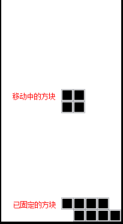
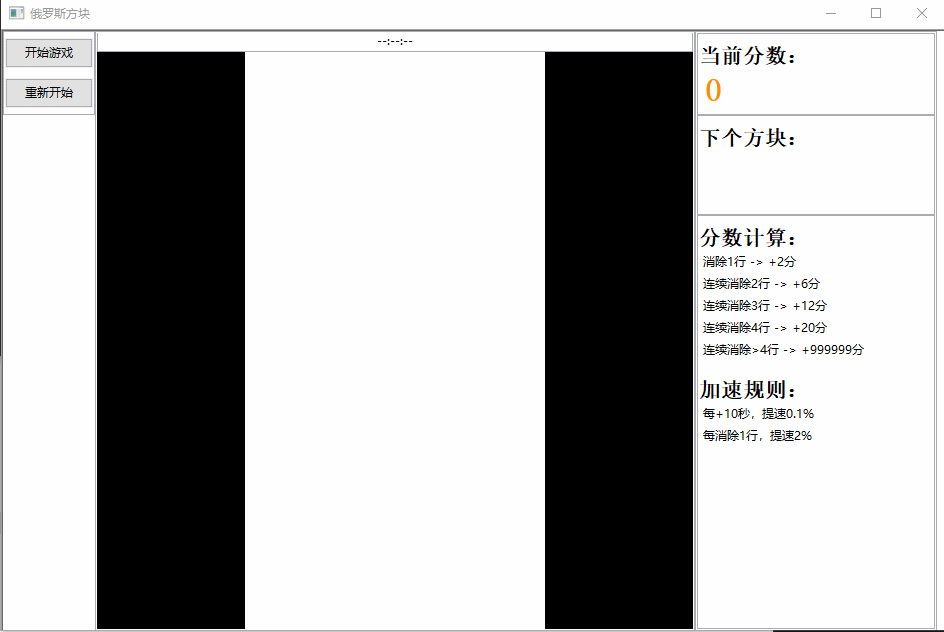

# 基于Python+wxPython实现俄罗斯方块游戏

----

## 俄罗斯方块简介
  * 《俄罗斯方块》（Tetris， 俄文：Тетрис）是一款由俄罗斯人阿列克谢·帕基特诺夫（Алексей Пажитнов 英文：Alexey Pazhitnov）于1984年6月发明的休闲游戏。当时，在俄罗斯科学院计算机中心工作的数学家帕基特诺夫为了测试一种计算机的性能，于是利用空闲时间编写出了一个游戏程序，而该游戏程序就是**俄罗斯方块**。
  * 《俄罗斯方块》的基本规则是移动、旋转和摆放游戏自动输出的各种方块，使之排列成完整的一行或多行并且消除得分。


## 游戏要素拆分
  * 场景：可以理解为方块的可移动区域（相当于背景）；
  * 方块：分成移动中（即正在下落的）的和已固定的格子；
  * 定时器：按一定时间（可能会根据所得分数进行变化）刷新移动中的方块位置；
  * 碰撞检测：判断移动或旋转的下一步位置中，是否有已固定的格子，若有则表示发生了碰撞；
  * 结束判断：当移动中的方块无法向下移动且已超出顶部时，则游戏结束。

----



## 1. 场景
场景是构成游戏的必要部分，是承载游戏中所有物体的基石（大部分情况下是所有游戏物体的父节点）。  

一个游戏中可以有多个场景，其中存在场景管理器（一般是全局变量），来进行如场景启动、切换和停止等操作。  

而这里的俄罗斯方块只需一个场景，故没有设计场景管理器，而且此场景也很简单，只需根据其尺寸和颜色配置，构建出一个平面即可。  


## 2. 方块
这里的方块，可以理解为游戏物体，其尺寸由背景尺寸和方块数量（背景尺寸/方块数量）决定，然后可按照一定的组合方式，构建出一个形状，如`I、J、L、O、S、Z、T`。  

如下所示，该函数用于获取对应形状的方块位置列表。  
```py
# 根据传入位置，返回对应形状的方块位置列表
def getMovingItemPosList(startPos, key = None):
    if not key:
        key = random.choice(["I", "J", "L", "O", "S", "Z", "T"]);
    if key == "I":
        return [
            [startPos[0]-3, startPos[1]],
            [startPos[0]-2, startPos[1]],
            [startPos[0]-1, startPos[1]],
            [startPos[0], startPos[1]]
        ];
    elif key == "J":
        return [
            [startPos[0]-2, startPos[1]],
            [startPos[0]-1, startPos[1]],
            [startPos[0], startPos[1]],
            [startPos[0], startPos[1]-1],
        ];
    elif key == "L":
        return [
            [startPos[0]-2, startPos[1]],
            [startPos[0]-1, startPos[1]],
            [startPos[0], startPos[1]],
            [startPos[0], startPos[1]+1],
        ];
    elif key == "O":
        return [
            [startPos[0]-1, startPos[1]],
            [startPos[0]-1, startPos[1]+1],
            [startPos[0], startPos[1]],
            [startPos[0], startPos[1]+1],
        ];
    elif key == "S":
        return [
            [startPos[0]-1, startPos[1]+1],
            [startPos[0]-1, startPos[1]],
            [startPos[0], startPos[1]],
            [startPos[0], startPos[1]-1],
        ];
    elif key == "Z":
        return [
            [startPos[0]-1, startPos[1]-1],
            [startPos[0]-1, startPos[1]],
            [startPos[0], startPos[1]],
            [startPos[0], startPos[1]+1],
        ];
    elif key == "T":
        return [
            [startPos[0]-1, startPos[1]-1],
            [startPos[0]-1, startPos[1]],
            [startPos[0]-1, startPos[1]+1],
            [startPos[0], startPos[1]],
        ];
    raise Exception("Error key[{}]".format(key));
```

在游戏中，将方块分成了两种类型：移动中的和已固定的。  

其中，**移动中的**方块在每次移动时，会先检测是否能移动，若不能且本次移动方向是**向下的**，则会先判断游戏是否结束。  
当游戏仍需继续进行时，就将这些移动中的方块设置为**已固定的**类型，并且进行方块消除的判断和处理逻辑，同时生成新的可移动方块。  
```py
# 移动方块
def moveItemList(self, direction = Direction.BOTTOM):
    if self.__playing:
        if self.checkDirection(direction): # 检测该方向是否能移动
            for item in self.__movingItemList:
                row, col = item.m_mt;
                if direction == Direction.BOTTOM:
                    row+=1;
                elif direction == Direction.LEFT:
                    col-=1;
                elif direction == Direction.RIGHT:
                    col+=1;
                self.moveItem(item, row, col);
        elif direction == Direction.BOTTOM: # 检测该方向是否移动方向是向下的
            if not self.checkGameOver(): # 判断游戏是否结束
                self.setFixedItemMatrix(); # 将移动中的方块设置为已固定的类型
                self.eliminateSquares(); # 检测并消除方块
                self.createMovingItemList(); # 生成新的可移动方块
```

对于移动中的方块来说，还有很重要的一点就是，允许这些方块按照其形状进行旋转。  

然而要进行方块旋转，得先确定旋转点和旋转角度。  

通过分析俄罗斯方块的形状特点，及以上**获取对应形状的方块位置列表函数**，可以简单将旋转点定为形状中的第二个方块。  
至于旋转角度，则直接设定为`负90度`（顺时针旋转90度）。  
```py
# 旋转方块
def rotateItemList(self):
if self.__playing and len(self.__movingItemList) > 0:
    # 获取Item的移动数据
    newItemMtList = [];
    centerRow, centerCol = self.__movingItemList[1].m_mt;
    angle = -math.pi/2; # 旋转角度
    sinVal, cosVal = int(math.sin(angle)), int(math.cos(angle));
    rows, cols = self.__params["matrix"][0], self.__params["matrix"][1];
    for item in self.__movingItemList:
        row, col = item.m_mt;
        newRow = centerRow + (row - centerRow) * cosVal - (col - centerCol) * sinVal;
        newCol = centerCol + (col - centerCol) * cosVal + (row - centerRow) * sinVal;
        if newRow >= rows or newCol < 0 or newCol >= cols:
            return
        elif newRow >= 0 and self.__fixedItemMatrix[newRow][newCol]:
            return
        newItemMtList.append((item, newRow, newCol));
    # 移动Item
    for itemMt in newItemMtList:
        self.moveItem(*itemMt);
```


## 3. 定时器
在每次定时器的回调中，将移动中的方块向下移动（如果可以移动的话），同时判定是否要对速度进行升级，是的话则会重新启动定时器（该定时器的时间间隔已在其他地方被改变）。  
```py
def onTimer(self, event = None):
    self.moveItemList();
    if self.__isSpeedUp:
        self.startTimer();
        self.__isSpeedUp = False;
    self.checkToFocusSelf(); # 检测是否重新对焦自己（这是为了将按键事件能传到self上）
```


## 4. 碰撞检测
首先要明确的，就是哪些物体需要进行碰撞检测。  

在整个场景中，可移动的物体就只有**移动中的方块**，因此进行碰撞检测的物体，必定包含移动中的方块。  
然后，根据方块不可重叠，且不能超出背景的左、右、下边框的设定，可知已固定的方块，以及左、右、下的边框，都需要跟移动中的物体进行碰撞检测。  

在实现中，每次移动方块时，会先检测方块是否能往目标方向移动，而这种检测可以理解为是对移动中的方块的碰撞检测。  

以下是具体实现代码：通过判定移动中的方块所要移动的目标位置，是否在边界之外，或有没被已固定的方块占据，来辨别是否发生了碰撞。  
```py
# 检测方向（可以理解为检测该方向是否产生了碰撞）
def checkDirection(self, direction):
    if direction in [Direction.LEFT, Direction.TOP, Direction.RIGHT, Direction.BOTTOM]:
        for item in self.__movingItemList:
            row, col = item.m_mt;
            if direction == Direction.BOTTOM:
                row+=1;
            elif direction == Direction.LEFT:
                col-=1;
            elif direction == Direction.RIGHT:
                col+=1;
            rows, cols = self.__params["matrix"][0], self.__params["matrix"][1];
            if row >= rows or col < 0 or col >= cols:
                return False;
            elif row >= 0 and self.__fixedItemMatrix[row][col]:
                return False;
        return True;
    return False;
```


## 5. 结束判断
当移动中的方块无法向下移动且已超出顶部时，则游戏结束。  

由定时器回调可知，当移动中的方块无法向下移动时，会调用`checkGameOver`函数，因此该函数只需判断移动中的方块是否已超出顶部即可。
```py
def checkGameOver(self):
    for item in self.__movingItemList:
        if item.m_mt[0] <= 0:
            self.onGameOver();
            return True;
    return False;
```


## 完整项目
Github地址：  
[https://github.com/pytoolsip-tools/tetris](https://github.com/pytoolsip-tools/tetris)


## 运行项目
有两种运行方案：  

（1）在确保电脑已安装了`python`环境（最好是3.7版本）的情况下，直接运行工程下的`run.bat`脚本，会自动安装该工具所依赖的模块。  


（2）可以通过[PyToolsIP官网](http://ptip.jdreamheart.com)下载安装程序，安装并运行`PyToolsIP`程序（该安装目录下的`include/python`就是`PyToolsIP`程序的`python`运行环境）。  
然后更改该项目的运行环境：  
  * 用文本编辑器打开该项目下的`_tool.env`，添加配置语句：`pyexe=PyToolsIP程序的python环境目录`（注意是是具体到python.exe的目录，且不能包含空格）；

**当然也可以直接在`PyToolsIP`程序中的首页点击下载俄罗斯方块，然后运行该工具即可。**  

**运行结果**  

左、右、下按键用于控制移动中方块的移动方向，空格键控制移动中的方块进行旋转。